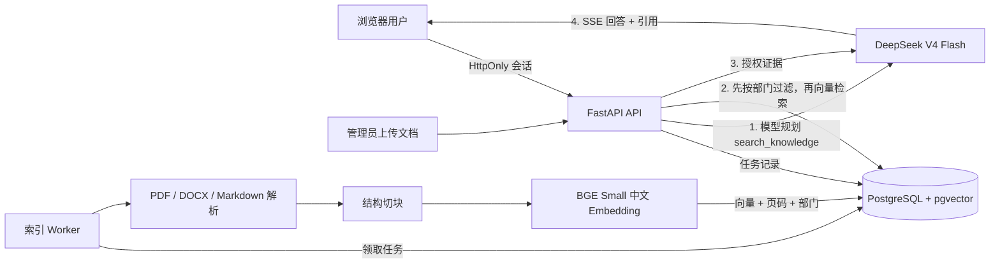

# 知域：企业级 RAG 知识库问答 Agent

一个可直接写进简历的企业知识库项目：支持 PDF、DOCX、Markdown 异步索引，部门级文档权限，DeepSeek 工具调用，可追溯引用，证据不足拒答，以及 50 题自动评测。

准备录制项目演示时，可直接照着 [两分钟演示脚本](docs/demo-script.md) 操作，避免画面中出现真实 API Key 或敏感资料。

> 当前状态：核心功能、Docker 联调、三种文件格式、部门 ACL、扫描件失败重试、50 题评测和一次真实 DeepSeek SSE 问答均已实测通过。结果与测试条件见下文。

## 系统架构



三个 Docker Compose 服务共用一套应用镜像：

- `api`：登录、文档管理、检索、DeepSeek 流式问答和网页。
- `worker`：领取 PostgreSQL 中的索引任务，失败指数退避，最多重试三次。
- `postgres`：账号、权限、文档、任务、对话、Trace 和 512 维向量。

PostgreSQL 同时承担业务存储、任务队列和向量检索；首版不额外引入 Redis、Celery 或独立向量数据库。

## 已实现能力

- SHA-256 文件去重、20 MB 限制、扩展名白名单和安全文件名。
- PDF 按真实页码引用；DOCX 无可靠分页信息时显示片段序号，避免伪造页码；Markdown 保留片段序号。扫描 PDF 会明确失败，不静默产出空索引。
- 约 700 字切块和 100 字重叠，`BAAI/bge-small-zh-v1.5` CPU Embedding。
- 管理员、研发、财务三类演示身份；普通员工只能看到 `all` 和本人部门文档。
- ACL 在 SQL 向量查询中生效，而不是检索完成后再过滤。
- DeepSeek 强制调用 `search_knowledge`，证据不足时最多改写检索一次。
- 证据门同时检查向量相似度与中文双字词覆盖率，减少“语义看似接近但文档没有答案”的误答。
- 文档内容被标记为不可信数据；证据低于阈值时固定拒答。
- SSE 流式回答、文档/页码/片段引用、检索与生成耗时、Token 统计。
- PostgreSQL 中保存对话、检索命中和错误 Trace，但不记录密码、Key 或完整提示词。

## Windows 启动

### 1. 安装准备

安装并启动 Docker Desktop，确认 PowerShell 中可以运行：

```powershell
docker --version
docker compose version
```

### 2. 创建配置

```powershell
Copy-Item .env.example .env
notepad .env
```

至少修改以下两项：

```dotenv
DEEPSEEK_API_KEY=你的真实Key
SESSION_SECRET=至少32位的随机字符串
COOKIE_SECURE=false
```

可以用 PowerShell 生成随机 Session Secret：

```powershell
[Convert]::ToBase64String([Security.Cryptography.RandomNumberGenerator]::GetBytes(32))
```

`.env` 已加入 `.gitignore`，不要把真实 Key 提交到 Git。

### 3. 启动

```powershell
.\start.ps1
```

若项目路径不含中文，也可直接运行：

```powershell
docker compose up --build
```

`start.ps1` 会在中文路径下自动建立 `R:` 临时映射，规避 Docker BuildKit 的 `x-docker-expose-session-sharedkey` 非 ASCII 报错。

第一次索引会下载本地 BGE 模型。下载完成后模型缓存在 Docker Volume 中。打开 <http://127.0.0.1:8000>。

### 4. 导入演示文档

保持服务运行，在另一个 PowerShell 窗口执行：

```powershell
docker compose exec api python -m scripts.load_demo
```

在“知识文档”页面等待五份文档全部变为 `ready`。

### 5. 演示账号

| 账号 | 密码 | 权限 |
|---|---|---|
| `admin` | `Admin123!` | 管理员，可上传、删除和访问全部部门 |
| `engineer` | `Engineer123!` | 研发员工，只能访问全公司和研发资料 |
| `finance` | `Finance123!` | 财务员工，只能访问全公司和财务资料 |

这些账号仅用于本地演示。真实部署必须删除默认账号并接入企业身份系统。

## API

| 方法 | 地址 | 权限 | 用途 |
|---|---|---|---|
| `POST` | `/api/auth/login` | 公开 | 登录并设置 HttpOnly Cookie |
| `POST` | `/api/auth/logout` | 登录 | 删除会话 Cookie |
| `GET` | `/api/auth/me` | 登录 | 当前用户信息 |
| `POST` | `/api/documents` | 管理员 | 上传文档并创建索引任务 |
| `GET` | `/api/documents` | 登录 | 列出授权文档 |
| `GET` | `/api/documents/{id}/status` | 授权 | 查看索引状态和错误 |
| `POST` | `/api/documents/{id}/retry` | 管理员 | 重试失败任务 |
| `DELETE` | `/api/documents/{id}` | 管理员 | 删除文件、片段和向量 |
| `POST` | `/api/chat/stream` | 登录 | SSE 流式 RAG 问答 |
| `GET` | `/api/health` | 公开 | 数据库、模型配置状态 |

浏览器请求示例：

```json
{
  "question": "生产发布的灰度流程是什么？",
  "conversation_id": null
}
```

SSE 依次返回 `meta`、`status`、`sources`、若干 `delta` 和 `done`；错误返回 `error`。

## 自动评测

仓库内置 [eval/questions.json](eval/questions.json)，包含 30 道单文档题、10 道跨文档题和 10 道不可回答题；[eval/answer_key.json](eval/answer_key.json) 标注了答案要点、正确文档、页码和章节。索引准备好后运行：

```powershell
docker compose exec api python -m scripts.evaluate
```

查看每题细节：

```powershell
docker compose exec api python -m scripts.evaluate --details
```

脚本测量：

- `Recall@5`：标准答案文档是否进入前五个检索结果。
- `single_document_hit_at_1`：30 道单文档题的第一条命中是否正确；在小型知识库中比 Recall@5 更有区分度。
- `answerable_acceptance`：可回答题是否通过证据充分性检查。
- `refusal_accuracy`：不可回答问题是否低于拒答阈值。
- `acl_violations`：检索结果是否出现越权部门，必须为 0。

脚本在 `Recall@5 < 0.8`、可回答题通过率 `< 0.8`、拒答率 `< 0.8` 或存在越权时返回非零退出码。不要只提高相似度阈值来追求拒答率，否则会同时拒绝有答案的问题；只有评测证明基础检索不足时再增加 Reranker。

累计完成一批真实问答后，汇总 P50/P95、失败率和 Token：

```powershell
docker compose exec api python -m scripts.report_metrics
```

## 测试与验证

项目依赖全部留在 Docker 中。运行核心测试（`start.ps1` 已为当前中文路径建立 `R:` 映射）：

```powershell
docker run --rm -v "R:\:/workspace" -w /workspace rag-agent-api pytest -q tests/test_core.py
```

容器运行并导入演示文档后，执行权限集成测试：

```powershell
docker run --rm -e RUN_LIVE_TESTS=1 -e APP_BASE_URL=http://host.docker.internal:8000 `
  -v "R:\:/workspace" -w /workspace rag-agent-api pytest -q tests/test_live_acl.py
```

真实文件生命周期测试覆盖三种格式、SHA-256 去重、扫描件失败重试和删除；测试会自动清理自己上传的夹具文档：

```powershell
docker run --rm -e RUN_LIVE_TESTS=1 -e APP_BASE_URL=http://host.docker.internal:8000 `
  -v "R:\:/workspace" -w /workspace rag-agent-api pytest -q tests/test_live_documents.py
```

完整验收：

1. 分别上传 PDF、DOCX、Markdown，状态最终为 `ready`。
2. 重复上传返回 HTTP 409；扫描 PDF 显示明确失败原因并可以重试。
3. 研发账号看不到财务文档，财务账号看不到研发文档。
4. 检索与回答引用指向真实文档和页码；删除文档后相关向量消失。
5. 执行 50 题评测并将真实结果填写到下表。

| 指标 | 目标 | 实测 |
|---|---:|---:|
| Recall@5 | ≥ 80% | **100%（50 题）** |
| 单文档 Hit@1 | 仅记录 | **90%（30 题）** |
| 可回答题证据通过率 | ≥ 80% | **100%（40 题）** |
| 不可回答题拒答率 | ≥ 80% | **80%（10 题）** |
| 部门越权 | 0 | **0（ACL 集成测试 2/2）** |
| 单次真实问答耗时 | 仅记录，不虚构并发指标 | 检索 61 ms；首字 1,525 ms；总计 2,474 ms |

测试环境为 Windows 11、Docker Desktop、CPU Embedding、5 份演示文档。由于每个普通账号最多只可检索 4 份文档，而 `k=5`，Recall@5 天然偏宽松，因此同时报告更严格的单文档 Hit@1。延迟数据只有一次成功问答样本，不代表并发能力或稳定分位数。

### 一次真实失败改进

最初只用向量相似度阈值时，不可回答题仅正确拒答 1/10。单纯提高阈值虽能改善拒答，却会把大量有答案问题一起拒绝。加入无额外模型依赖的中文双字词覆盖率证据门后，可回答题通过率保持 40/40，不可回答题拒答提升到 8/10。当前仍有两道边界题未正确拒答，作为后续加入 Reranker 或答案蕴含判别器的明确改进点。

## 安全设计与已知边界

- 密码使用带随机盐的 `scrypt`；会话使用 HMAC-SHA256 签名、过期时间和 `SameSite=Strict` Cookie。
- 本地 HTTP 环境保持 `COOKIE_SECURE=false`。公网部署必须通过 HTTPS，并设置 `COOKIE_SECURE=true`。
- 文档内容不能修改系统提示词；前端始终使用 `textContent` 展示模型和文档内容。
- 权限过滤与向量查询位于同一条 SQL 中。API 对无权限文档统一返回 404，降低 ID 枚举泄露。
- 当前是单组织、固定部门的简历 MVP，不支持 OCR、多租户、Kubernetes、知识图谱和复杂 Reranker。
- `create_all` 足以初始化空仓库；出现第二版数据库结构时再加入 Alembic 迁移。

## 常见失败

- **`docker` 不是命令**：安装 Docker Desktop 并重新打开 PowerShell。
- **健康页显示缺少 DeepSeek Key**：检查 `.env` 的 `DEEPSEEK_API_KEY`，然后执行 `docker compose restart api`。
- **Worker 首次长时间 processing**：首次需要下载 BGE 模型；查看 `docker compose logs -f worker`。
- **扫描 PDF 索引失败**：首版不支持 OCR，请换成带文本层 PDF。
- **SOCKS 代理报缺少依赖**：项目已固定 `socksio`；重新构建镜像以确保依赖生效。

## 简历描述模板

> 设计并实现企业级 RAG 知识库 Agent，支持 PDF/DOCX/Markdown 异步索引、部门级 ACL、DeepSeek 工具调用、可追溯引用与自动拒答；在 50 题评测集上取得 **100% Recall@5、90% 单文档 Hit@1 与 80% 不可回答题拒答率**，部门越权测试为 **0**。
