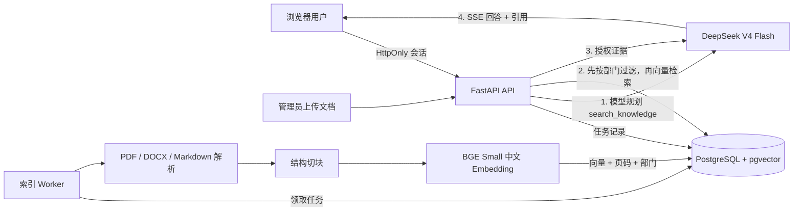

# 知域：企业级 RAG 知识库问答 Agent

[](https://github.com/zhli3424-prog/enterprise-rag-agent/actions/workflows/ci.yml)
[](LICENSE)

知域是一个面向企业内部资料检索的可控 RAG 知识库问答系统。项目支持 PDF、DOCX、Markdown 异步索引，通过部门级访问控制约束检索范围，并使用 DeepSeek 工具调用生成带来源引用的流式回答；证据不足时明确拒答。

项目重点不是封装一个普通聊天接口，而是完整实现文档接入、权限过滤、向量检索、证据判断、回答生成、引用追踪和离线评测闭环。

## 项目状态

核心功能、Docker 联调、三种文件格式、部门 ACL、上传内容校验、持久化会话恢复、Worker 超时恢复、Nginx 双 API 轮询、50 题检索评测和真实 DeepSeek SSE 问答均已完成验证。指标、样本规模和已知边界均在本文中公开说明。

## 目录

- [系统架构](#系统架构)
- [核心能力](#核心能力)
- [技术栈](#技术栈)
- [快速开始](#快速开始)
- [API](#api)
- [自动评测](#自动评测)
- [测试与验证](#测试与验证)
- [安全设计与已知边界](#安全设计与已知边界)
- [开源协作](#开源协作)

## 系统架构



默认 Docker Compose 部署包含三个服务，并让 API 与 Worker 共用一套应用镜像：

- `api`：登录、文档管理、检索、DeepSeek 流式问答和网页。
- `worker`：领取 PostgreSQL 中的索引任务，失败指数退避，最多重试三次；每 30 秒恢复超过 15 分钟未完成的任务。
- `postgres`：账号、权限、文档、任务、对话、Trace 和 512 维向量。

PostgreSQL 同时承担业务存储、任务队列和向量检索；首版不额外引入 Redis、Celery 或独立向量数据库。

可选的 [Nginx 双 API 部署](docs/linux-nginx-deployment.md) 在 `8080` 端口提供反向代理，并将请求轮询到两个 FastAPI 容器。该配置已在 Docker Desktop 验证，不等同于 Linux 生产上线。

## 核心能力

- SHA-256 文件去重、20 MB 限制、扩展名白名单和安全文件名；上传后校验 PDF 签名、DOCX 包结构和 Markdown UTF-8 文本，拒绝伪装扩展名。
- PDF 按真实页码引用；DOCX 无可靠分页信息时显示片段序号，避免伪造页码；Markdown 保留片段序号。扫描 PDF 会明确失败，不静默产出空索引。
- 约 700 字切块和 100 字重叠，`BAAI/bge-small-zh-v1.5` CPU Embedding。
- 管理员、研发、财务三类演示身份；普通员工只能看到 `all` 和本人部门文档。
- ACL 在 SQL 向量查询中生效，而不是检索完成后再过滤。
- DeepSeek 强制调用 `search_knowledge`，证据不足时最多改写检索一次。
- 证据门同时检查向量相似度与中文双字词覆盖率，减少“语义看似接近但文档没有答案”的误答。
- 文档内容被标记为不可信数据；证据低于阈值时固定拒答。
- SSE 流式回答、文档/页码/片段引用、检索与生成耗时、Token 统计。
- PostgreSQL 中保存对话、检索命中和错误 Trace；页面可恢复本人最近 50 个会话，但不记录密码、Key 或完整提示词。

## 技术栈

| 分类 | 技术 | 作用 |
|---|---|---|
| API | Python 3.12、FastAPI、SQLAlchemy | 登录、文档管理、会话和流式问答接口 |
| LLM | DeepSeek Chat Completion / Tool Calling | 查询规划、检索工具调用和最终回答 |
| 检索 | BGE Small 中文模型、pgvector HNSW | 本地向量生成和带 ACL 的相似度检索 |
| 数据 | PostgreSQL 17 | 业务数据、会话、任务、Trace 和向量统一存储 |
| 前端 | HTML、CSS、JavaScript | 轻量管理与问答界面 |
| 部署 | Docker Compose、Nginx | 服务编排与可选双 API 反向代理 |

项目没有使用 LangChain 或 LangGraph；Agent 工作流由原生 Python 显式控制，便于审计工具调用、权限过滤和拒答条件。

## 仓库结构

```text
app/            FastAPI、RAG、权限、解析、Worker 与网页
deploy/         Nginx 配置
docs/           部署与演示说明
eval/           50 题评测集、标准答案与结果样例
sample_docs/    无敏感信息的演示知识库
scripts/        数据导入、检索评测、答案评测和指标汇总
tests/          核心单测及 Docker 集成测试
```

## 快速开始

以下流程已在 Windows 11 + Docker Desktop 环境验证。其他平台可直接使用 Docker Compose，Linux/Nginx 说明见[部署文档](docs/linux-nginx-deployment.md)。

### 1. 安装准备

安装并启动 Docker Desktop，确认 PowerShell 中可以运行：

```powershell
docker --version
docker compose version
```

### 2. 创建配置

```powershell
Copy-Item .env.example .env
notepad .env
```

至少修改以下两项：

```dotenv
DEEPSEEK_API_KEY=你的真实Key
SESSION_SECRET=至少32位的随机字符串
COOKIE_SECURE=false
```

可以用 PowerShell 生成随机 Session Secret：

```powershell
[Convert]::ToBase64String([Security.Cryptography.RandomNumberGenerator]::GetBytes(32))
```

`.env` 已加入 `.gitignore`，不要把真实 Key 提交到 Git。

### 3. 启动

```powershell
.\start.ps1
```

若项目路径不含中文，也可直接运行：

```powershell
docker compose up --build
```

`start.ps1` 会在中文路径下自动建立 `R:` 临时映射，规避 Docker BuildKit 的 `x-docker-expose-session-sharedkey` 非 ASCII 报错。

第一次索引会下载本地 BGE 模型。下载完成后模型缓存在 Docker Volume 中。打开 <http://127.0.0.1:8000>。

### 4. 导入演示文档

保持服务运行，在另一个 PowerShell 窗口执行：

```powershell
docker compose exec api python -m scripts.load_demo
```

在“知识文档”页面等待五份文档全部变为 `ready`。

### 5. 可选：Nginx 双 API 演示

```powershell
docker compose -f docker-compose.nginx.yml up --build -d
```

打开 <http://127.0.0.1:8080>。完整架构、轮询验证命令和生产边界见 [Linux / Nginx 部署演示](docs/linux-nginx-deployment.md)。

### 6. 演示账号

| 账号 | 密码 | 权限 |
|---|---|---|
| `admin` | `Admin123!` | 管理员，可上传、删除和访问全部部门 |
| `engineer` | `Engineer123!` | 研发员工，只能访问全公司和研发资料 |
| `finance` | `Finance123!` | 财务员工，只能访问全公司和财务资料 |

这些账号仅用于本地演示。真实部署必须删除默认账号并接入企业身份系统。

## API

| 方法 | 地址 | 权限 | 用途 |
|---|---|---|---|
| `POST` | `/api/auth/login` | 公开 | 登录并设置 HttpOnly Cookie |
| `POST` | `/api/auth/logout` | 登录 | 删除会话 Cookie |
| `GET` | `/api/auth/me` | 登录 | 当前用户信息 |
| `POST` | `/api/documents` | 管理员 | 上传文档并创建索引任务 |
| `GET` | `/api/documents` | 登录 | 列出授权文档 |
| `GET` | `/api/documents/{id}/status` | 授权 | 查看索引状态和错误 |
| `POST` | `/api/documents/{id}/retry` | 管理员 | 重试失败任务 |
| `DELETE` | `/api/documents/{id}` | 管理员 | 删除文件、片段和向量 |
| `GET` | `/api/conversations` | 登录 | 当前用户最近 50 个会话 |
| `GET` | `/api/conversations/{id}` | 会话所有者 | 恢复消息和原引用 |
| `POST` | `/api/chat/stream` | 登录 | SSE 流式 RAG 问答 |
| `GET` | `/api/health` | 公开 | 数据库、模型配置状态 |

浏览器请求示例：

```json
{
  "question": "生产发布的灰度流程是什么？",
  "conversation_id": null
}
```

SSE 依次返回 `meta`、`status`、`sources`、若干 `delta` 和 `done`；错误返回 `error`。

## 自动评测

仓库内置 [eval/questions.json](eval/questions.json)，包含 30 道单文档题、10 道跨文档题和 10 道不可回答题；[eval/answer_key.json](eval/answer_key.json) 标注了答案要点、正确文档、页码和章节。索引准备好后运行：

```powershell
docker compose exec api python -m scripts.evaluate
```

查看每题细节：

```powershell
docker compose exec api python -m scripts.evaluate --details
```

脚本测量：

- `Recall@5`：标准答案文档是否进入前五个检索结果。
- `single_document_hit_at_1`：30 道单文档题的第一条命中是否正确；在小型知识库中比 Recall@5 更有区分度。
- `answerable_acceptance`：可回答题是否通过证据充分性检查。
- `refusal_accuracy`：不可回答问题是否低于拒答阈值。
- `acl_violations`：检索结果是否出现越权部门，必须为 0。

脚本在 `Recall@5 < 0.8`、可回答题通过率 `< 0.8`、拒答率 `< 0.8` 或存在越权时返回非零退出码。不要只提高相似度阈值来追求拒答率，否则会同时拒绝有答案的问题；只有评测证明基础检索不足时再增加 Reranker。

### 最终答案与引用评测

检索评测不等于答案准确率。独立脚本会真实调用 `/api/chat/stream`，解析 `sources/delta/done/error`，并使用 [answer_key.json](eval/answer_key.json) 计算：

- 答案要点召回率：标准要点的中文双字词覆盖率达到 `0.55` 视为命中。
- 整题正确率：答案要点全部命中、引用索引合法且实际引用全部标准文档。
- 不可回答题拒答准确率。
- 引用索引有效率和引用文档召回率。

运行计划指定的 10 题：

```powershell
docker compose exec api python -m scripts.evaluate_answers `
  --ids q01,q05,q10,q16,q29,q31,q32,q40,q41,q45 `
  --output eval/answer_results_10.json
```

运行全部 50 题：

```powershell
docker compose exec api python -m scripts.evaluate_answers
```

可选 DeepSeek Judge 只作为补充判断；调用失败不会改变规则指标：

```powershell
docker compose exec api python -m scripts.evaluate_answers --llm-judge --judge-model deepseek-v4-flash
```

本轮指定 10 题的真实规则评测结果保存在 [eval/answer_results_10.json](eval/answer_results_10.json)：

| 最终答案指标 | 实测 |
|---|---:|
| 答案要点召回率 | **94.74%（18/19）** |
| 整题正确率 | **90%（9/10）** |
| 不可回答题拒答准确率 | **100%（2/2）** |
| 引用索引有效率 | **100%** |
| 引用文档召回率 | **100%** |

唯一未通过题为 `q32`：模型实际给出了 `5% → 25%` 两阶段灰度并各观察 20 分钟，但没有复述标准答案中的“两阶段、各”字样，导致中文双字词覆盖率为 `0.4375`，低于固定阈值 `0.55`。该案例说明规则评测可复现但对同义改写较敏感，因此保留可选 LLM Judge，而不把 10 题结果外推为生产答案准确率。

累计完成一批真实问答后，汇总 P50/P95、失败率和 Token：

```powershell
docker compose exec api python -m scripts.report_metrics
```

## 测试与验证

项目依赖全部留在 Docker 中。运行核心测试（`start.ps1` 已为当前中文路径建立 `R:` 映射）：

```powershell
docker run --rm -v "R:\:/workspace" -w /workspace rag-agent-api pytest -q tests/test_core.py
```

增强功能单测覆盖答案/引用规则和 Worker 恢复边界：

```powershell
docker run --rm -v "R:\:/workspace" -w /workspace rag-agent-api pytest -q tests/test_enhancements.py
```

容器运行并导入演示文档后，执行权限集成测试：

```powershell
docker run --rm -e RUN_LIVE_TESTS=1 -e APP_BASE_URL=http://host.docker.internal:8000 `
  -v "R:\:/workspace" -w /workspace rag-agent-api pytest -q tests/test_live_acl.py
```

真实文件生命周期测试覆盖三种格式、SHA-256 去重、扫描件失败重试和删除；测试会自动清理自己上传的夹具文档：

```powershell
docker run --rm -e RUN_LIVE_TESTS=1 -e APP_BASE_URL=http://host.docker.internal:8000 `
  -v "R:\:/workspace" -w /workspace rag-agent-api pytest -q tests/test_live_documents.py
```

真实会话测试会生成一次 DeepSeek 问答，并验证历史列表、消息顺序、引用恢复和跨用户 404：

```powershell
docker run --rm -e RUN_LIVE_TESTS=1 -e APP_BASE_URL=http://host.docker.internal:8000 `
  -v "R:\:/workspace" -w /workspace rag-agent-api pytest -q tests/test_live_conversations.py
```

完整验收：

1. 分别上传 PDF、DOCX、Markdown，状态最终为 `ready`。
2. 重复上传返回 HTTP 409；扫描 PDF 显示明确失败原因并可以重试。
3. 研发账号看不到财务文档，财务账号看不到研发文档。
4. 检索与回答引用指向真实文档和页码；删除文档后相关向量消失。
5. 执行 50 题评测并将真实结果填写到下表。

| 指标 | 目标 | 实测 |
|---|---:|---:|
| Recall@5 | ≥ 80% | **100%（50 题）** |
| 单文档 Hit@1 | 仅记录 | **90%（30 题）** |
| 可回答题证据通过率 | ≥ 80% | **100%（40 题）** |
| 不可回答题拒答率 | ≥ 80% | **80%（10 题）** |
| 部门越权 | 0 | **0（ACL 集成测试 2/2）** |
| 最终答案整题正确率 | 仅记录 | **90%（指定 10 题）** |
| 最终答案引用文档召回率 | 仅记录 | **100%（指定 10 题）** |
| 单次真实问答耗时 | 仅记录，不虚构并发指标 | 检索 61 ms；首字 1,525 ms；总计 2,474 ms |

测试环境为 Windows 11、Docker Desktop、CPU Embedding、5 份演示文档。由于每个普通账号最多只可检索 4 份文档，而 `k=5`，Recall@5 天然偏宽松，因此同时报告更严格的单文档 Hit@1。延迟数据只有一次成功问答样本，不代表并发能力或稳定分位数。

### 一次真实失败改进

最初只用向量相似度阈值时，不可回答题仅正确拒答 1/10。单纯提高阈值虽能改善拒答，却会把大量有答案问题一起拒绝。加入无额外模型依赖的中文双字词覆盖率证据门后，可回答题通过率保持 40/40，不可回答题拒答提升到 8/10。当前仍有两道边界题未正确拒答，作为后续加入 Reranker 或答案蕴含判别器的明确改进点。

## 安全设计与已知边界

- 密码使用带随机盐的 `scrypt`；会话使用 HMAC-SHA256 签名、过期时间和 `SameSite=Strict` Cookie。
- 本地 HTTP 环境保持 `COOKIE_SECURE=false`。公网部署必须通过 HTTPS，并设置 `COOKIE_SECURE=true`。
- 文档内容不能修改系统提示词；前端始终使用 `textContent` 展示模型和文档内容。
- 权限过滤与向量查询位于同一条 SQL 中。API 对无权限文档统一返回 404，降低 ID 枚举泄露。
- 当前是单组织、固定部门的本地部署 MVP，不支持 OCR、多租户、Kubernetes、知识图谱和复杂 Reranker。
- Nginx 双 API 轮询仅在本地容器环境验证，尚未完成 Linux 生产部署、HTTPS 配置或高并发压测。
- Memory 是可恢复的持久化短期会话上下文：生成只读取最近消息，不包含长期用户画像、摘要记忆或向量记忆。
- `create_all` 足以初始化空仓库；出现第二版数据库结构时再加入 Alembic 迁移。

## 开源协作

- [MIT License](LICENSE)，版权归 `2026 zhli3424-prog`。
- 提交代码前请阅读[贡献指南](CONTRIBUTING.md)，安全问题请按[安全策略](SECURITY.md)报告。
- GitHub Actions 使用 Python 3.12，只安装核心测试所需的轻量依赖，不下载 Torch/BGE 模型。
- CI 执行 Python 编译、16 项核心/增强单测、两份 Compose 配置校验、评测 JSON 校验和 `.env` 未跟踪检查。
- 真实 DeepSeek、pgvector 和文件生命周期测试保留为本地 Docker 验收，避免在公开 CI 中使用 API Key 或下载完整模型。

功能演示可参考[两分钟演示脚本](docs/demo-script.md)。

## 常见失败

- **`docker` 不是命令**：安装 Docker Desktop 并重新打开 PowerShell。
- **健康页显示缺少 DeepSeek Key**：检查 `.env` 的 `DEEPSEEK_API_KEY`，然后执行 `docker compose restart api`。
- **Worker 首次长时间 processing**：首次需要下载 BGE 模型；查看 `docker compose logs -f worker`。
- **扫描 PDF 索引失败**：首版不支持 OCR，请换成带文本层 PDF。
- **SOCKS 代理报缺少依赖**：项目已固定 `socksio`；重新构建镜像以确保依赖生效。
