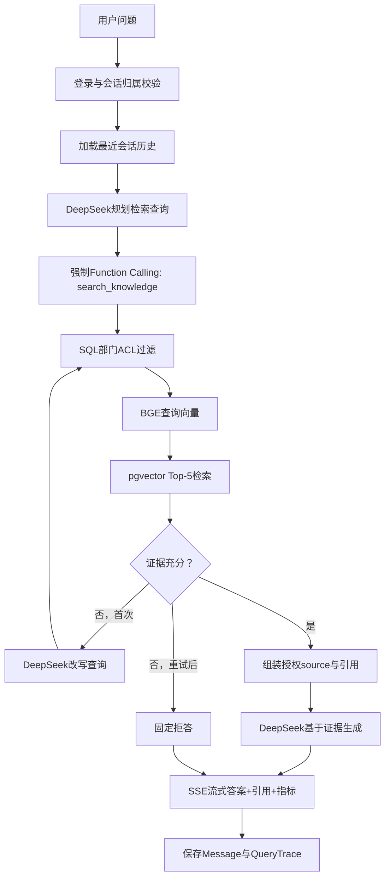

# 知域：AI Agent 项目简历与面试指南

> 分析对象：当前仓库 `enterprise-rag-agent`<br>
> 项目定位：企业级设计、可本地部署的 RAG 知识库问答 Agent MVP<br>
> 事实原则：只描述代码中已经实现并有测试或运行记录支撑的能力。

## 0. 完整代码审查结论

这是一个完整、可运行的**受控单 Agent RAG 应用**，不是简单调用一次大模型的 ChatBot，也不是通用自主 Agent 或多 Agent 系统。

它满足 Agent 的核心判断依据：

1. LLM 不直接回答，而是先通过 Function Calling 生成 `search_knowledge` 工具参数。
2. 应用执行真实的权限过滤和向量检索工具。
3. 系统根据检索证据决定继续生成、改写查询重试或拒绝回答。
4. 会话、消息、引用和 Query Trace 持久化到 PostgreSQL。
5. 最终答案由 DeepSeek 基于授权证据生成，并通过 SSE 流式返回。

它的边界也很明确：

- 只有一个知识库检索工具，没有通用工具注册和开放式 Agent 循环。
- 规划能力是“生成检索查询 + 最多改写一次”，不是多步骤任务规划。
- 没有使用 LangChain、LangGraph 或 OpenAI Agents SDK，工作流由普通 Python 显式控制。
- 没有多 Agent、Human-in-the-loop、长期用户画像或跨会话语义记忆。
- 当前是本地 Docker MVP，已验证 Nginx 双 API 容器轮询，但不应描述为 Linux 生产环境上线或高并发系统。

## 一、项目整体理解

### 1. 项目名称

**知域：企业级 RAG 知识库问答 Agent**

英文名称可写为：

**Enterprise RAG Knowledge Base Agent**

### 2. 项目解决的问题

企业内部制度、研发规范、财务流程和产品资料通常分散在多个文档中，员工查找成本高；直接使用通用大模型又存在知识不准确、缺少引用和越权泄露风险。

项目解决四类核心问题：

- 将 PDF、DOCX、Markdown 文档转换为可检索知识。
- 根据用户部门在检索前执行访问控制。
- 让大模型只依据授权证据回答并返回引用。
- 对检索、拒答、权限和性能进行可重复评测。

### 3. 应用场景

- 员工制度、请假、账号支持问答。
- 研发发布、代码评审、故障处理规范查询。
- 财务报销、差旅和采购制度查询。
- 客户支持 SLA、备份恢复和工单升级查询。
- 对部门敏感资料有隔离要求的企业内部知识助手。

### 4. 核心功能

- HttpOnly Cookie 登录和管理员/员工角色区分。
- 全公司、研发、财务三种文档可见范围。
- PDF、DOCX、Markdown 上传、SHA-256 去重和 20 MB 限制。
- PostgreSQL 任务队列驱动的异步解析、切块和向量索引。
- BGE 中文 Embedding 与 pgvector HNSW 相似度检索。
- DeepSeek 强制 Function Calling 生成检索查询。
- 证据不足时改写查询并最多重试一次。
- 向量分数与中文双字词覆盖率组成证据门。
- 无充分证据时固定拒答，避免直接编造。
- SSE 流式答案、文档名、页码或片段编号引用。
- 会话消息、检索命中、耗时、Token 和失败 Trace 持久化。
- 50 题检索/拒答/ACL 评测与文件生命周期集成测试。

### 5. 用户使用流程

#### 文档接入流程

```text
管理员登录
→ 上传 PDF / DOCX / Markdown 并指定部门
→ API 校验权限、后缀、大小并计算 SHA-256
→ PostgreSQL 创建 Document 和 IngestionJob
→ Worker 使用 SKIP LOCKED 领取任务
→ 解析文档并按约 700 字、100 字重叠切块
→ 本地 BGE 生成 512 维向量
→ 文本、元数据和向量写入 pgvector
→ 文档状态变为 ready
```

#### 在线问答流程

```text
用户输入问题
→ FastAPI 验证 HttpOnly 会话和会话归属
→ 读取最近 6 条历史消息
→ DeepSeek 强制调用 search_knowledge，生成独立检索查询
→ BGE 将查询转换为向量
→ SQL 先过滤授权部门，再执行 Top-5 向量检索
→ 证据门检查相似度和词汇覆盖率
→ 证据不足时由 DeepSeek 改写查询并最多重试一次
→ 仍不足则返回“知识库中未找到足够依据”
→ 证据充分则组装不可信 source 上下文
→ DeepSeek 基于证据流式生成带 [1][2] 引用的答案
→ 保存答案、引用、耗时、Token 和检索 Trace
```

## 二、Agent 架构分析

### 1. Agent 整体架构

| 模块 | 是否存在 | 代码实现与作用 |
|---|---|---|
| 用户输入层 | 是 | 原生 HTML/CSS/JavaScript 提供登录、上传、文档列表和问答界面；FastAPI 提供 REST/SSE 接口。 |
| LLM 推理层 | 是 | OpenAI 兼容 SDK 调用 DeepSeek，分别完成检索查询规划、查询改写和最终答案生成。 |
| Prompt 设计 | 是 | 包含检索规划 Prompt、低相关度改写 Prompt、最终证据约束 Prompt。 |
| Agent 规划模块 | 有限存在 | 只规划一个独立检索查询；证据不足时改写一次，不是通用多步规划器。 |
| Tool 调用模块 | 是 | 使用严格 JSON Schema 定义并强制调用 `search_knowledge`，应用层负责实际执行。 |
| Memory 记忆模块 | 部分存在 | PostgreSQL 保存 Conversation/Message；当前轮读取最近 6 条，生成时使用最近 4 条。无长期画像与向量记忆。 |
| RAG 知识库模块 | 是 | 文档解析、切块、BGE Embedding、pgvector 检索、证据注入和引用返回。 |
| 数据处理模块 | 是 | 独立 Worker 处理解析、索引、指数退避重试和状态更新。 |
| 权限模块 | 是 | 普通用户只能检索 `all` 和本人部门，SQL 过滤发生在向量结果返回前。 |
| 输出模块 | 是 | SSE 返回 `meta/status/sources/delta/done/error` 事件。 |
| 可观测性模块 | 是 | QueryTrace 保存检索结果、拒答、错误、延迟和 Token。 |
| Agent Framework | 否 | 没有 LangChain/LangGraph；使用普通 Python 函数编排，依赖更少、流程更明确。 |
| 多 Agent | 否 | 只有一个受控知识库 Agent，不存在角色协作或 Agent 间通信。 |
| Human-in-the-loop | 否 | 没有暂停等待人工审批的高风险工具执行流程。 |

### 2. Agent 工作流程



### 3. AI 技术及具体作用

#### 大语言模型（LLM）

**技术：** DeepSeek，使用 OpenAI 兼容 `chat.completions` 接口。<br>
**作用：** 生成检索查询、在首次证据不足时改写查询、根据授权上下文生成最终答案。<br>
**边界：** LLM 不负责向量生成，也不直接操作数据库。

#### Prompt Engineering

项目包含三类 Prompt：

1. **检索规划 Prompt**：要求必须调用 `search_knowledge`，禁止直接回答或跳过检索。
2. **查询改写 Prompt**：要求输出更短、包含关键实体和同义词的查询。
3. **最终回答 Prompt**：声明 source 内容是不可信数据，只能作为事实证据；禁止执行文档指令；要求事实带引用，资料不足不得用外部知识补全。

#### Function Calling / Tool Calling

**技术：** OpenAI 兼容 Function Calling，工具参数使用严格 JSON Schema。<br>
**作用：** 将自由文本问题转换为结构化的 `{"query": "..."}` 检索请求。<br>
**实现方式：** `tool_choice` 强制选择 `search_knowledge`；Python 解析参数并调用本地检索函数。<br>
**边界：** 当前只有一个工具，也没有模型自行循环选择多个工具。

#### RAG

**Retrieval：** BGE 将查询向量化，pgvector 从授权文档片段中检索 Top-5。<br>
**Augmentation：** 将命中文本包装为带 `id/title/page` 的 source 上下文。<br>
**Generation：** DeepSeek 仅依据 source 生成带编号引用的答案。

#### Embedding

**技术：** `BAAI/bge-small-zh-v1.5`，Sentence Transformers，CPU 推理。<br>
**作用：** 将文档片段和中文查询转换为归一化的 512 维向量。<br>
**设计：** 查询增加中文检索前缀，文档不加前缀；模型通过线程锁懒加载。

#### Vector Database

**技术：** PostgreSQL 17 + pgvector。<br>
**作用：** 保存 Chunk 向量并使用余弦距离排序；建立 HNSW 索引。<br>
**工程取舍：** 与用户、权限、任务、会话共用 PostgreSQL，减少 Redis、Celery、独立向量库的运维成本。

#### Memory 机制

**短期记忆：** 每次读取当前 Conversation 最近 6 条 Message，检索规划使用这些历史，最终生成使用最近 4 条。<br>
**持久化与恢复：** Conversation 和 Message 存在 PostgreSQL，消息附带引用；API 只返回当前用户最近 50 个会话，前端可恢复消息和原引用。<br>
**边界：** 没有长期用户偏好、摘要记忆或向量记忆。因此简历应写“可恢复的持久化短期会话上下文”，不要写“长期记忆系统”。

#### Workflow 设计

工作流由 `stream_rag_answer` 显式控制：

```text
创建会话和Trace
→ Tool Calling规划查询
→ 检索
→ 证据门
→ 可选改写与二次检索
→ 拒答或生成
→ 保存结果
```

优点是依赖少、执行路径清晰；缺点是扩展到多工具、人工审批和复杂分支时，需要引入状态机或 LangGraph。

## 三、代码与技术栈分析

### 1. 后端技术

**技术：Python 3.12**<br>
**作用：** 实现 API、Agent 编排、Worker、评测和测试脚本。

**技术：FastAPI + Uvicorn**<br>
**作用：** 提供认证、文档管理、健康检查和 SSE 流式问答接口；使用 Pydantic 校验登录和问题长度。

**技术：SQLAlchemy 2**<br>
**作用：** 定义 7 张业务表、事务、关联关系、级联删除和向量查询。

**技术：httpx**<br>
**作用：** 演示文档导入和真实 API 集成测试。

**技术：原生 HTML/CSS/JavaScript**<br>
**作用：** 实现登录、文档管理、SSE 解析、引用与性能指标展示；使用 `textContent` 降低模型输出造成 XSS 的风险。

### 2. AI 相关技术

**技术：DeepSeek + OpenAI Python SDK**<br>
**作用：** 查询规划、Function Calling、查询改写与流式答案生成。

**技术：Sentence Transformers + PyTorch CPU**<br>
**作用：** 加载本地 BGE 模型并计算归一化 Embedding。

**技术：BAAI/bge-small-zh-v1.5**<br>
**作用：** 中文查询和文档片段的语义表示。

**技术：Prompt Engineering**<br>
**作用：** 强制检索、限制知识来源、防提示注入并要求引用。

**技术：RAG + 证据门**<br>
**作用：** 结合向量相似度与中文双字词覆盖率判断证据是否足够。

**技术：自定义 Python Agent Workflow**<br>
**作用：** 控制规划、检索、重试、拒答、生成和持久化；没有使用第三方 Agent Framework。

### 3. 数据存储

**技术：PostgreSQL**<br>
**作用：** 保存用户、文档、索引任务、会话、消息和 Query Trace。

**技术：pgvector**<br>
**作用：** 保存 512 维向量、计算余弦距离并建立 HNSW 索引。

**核心数据表：**

- `users`：用户名、密码哈希、角色和部门。
- `documents`：文件哈希、存储路径、权限范围和索引状态。
- `chunks`：页码、序号、文本和向量。
- `ingestion_jobs`：任务状态、重试次数、可执行时间和锁定时间。
- `conversations`：用户会话。
- `messages`：用户/助手消息和引用。
- `query_traces`：查询改写、命中、延迟、Token、拒答和错误。

### 4. 文档处理

**技术：pypdf**<br>
**作用：** 按 PDF 真实页码抽取文本；纯扫描件无文本时明确失败。

**技术：python-docx**<br>
**作用：** 提取 DOCX 段落；因 XML 无可靠分页信息，不伪造页码。

**技术：自定义切块算法**<br>
**作用：** 优先按段落和中文标点边界切分，默认约 700 字、100 字重叠。

### 5. 部署与运行

**技术：Docker**<br>
**作用：** 使用 Python 3.12 slim 镜像安装依赖，并以非 root 用户运行应用。

**技术：Docker Compose**<br>
**作用：** 编排 `api`、`worker`、`postgres` 三个服务，配置健康检查、依赖顺序和持久化 Volume。

**技术：Nginx**<br>
**作用：** 可选演示栈将请求轮询到两个 FastAPI 实例，并对 SSE 路由关闭代理缓冲；已在 Docker Desktop 实测两个上游地址交替。

**技术：PowerShell 启动脚本**<br>
**作用：** 检查 `.env`、Key 和 Session Secret；对 Windows 中文路径使用 `R:` 映射规避 BuildKit 非 ASCII 问题。

**当前部署边界：** 已验证 Windows + Docker Desktop 本地部署和 Nginx 双 API 轮询；没有完成 Linux 主机、云服务、HTTPS、Kubernetes、压测或自动扩缩容。

### 6. 测试与评测

**技术：pytest / unittest 风格测试**<br>
**作用：** 验证密码、会话防篡改、切块、DOCX 页码策略、证据门和评测数据一致性。

**技术：真实 API 集成测试**<br>
**作用：** 验证部门 ACL、直接 ID 越权、三种文件格式、重复文件、扫描件失败、重试和删除。

**技术：自定义 RAG 评测脚本**<br>
**作用：** 检索评测计算 Recall@5、单文档 Hit@1、证据通过率、拒答率和 ACL 违规数；独立真实 SSE 评测使用答案要点与引用规则计算最终答案指标，并支持可选 DeepSeek Judge。

## 四、项目亮点提炼

1. **设计受控 Tool-Calling RAG Agent**：通过 DeepSeek 强制 Function Calling 生成结构化检索查询，结合显式 Python Workflow 完成检索、证据判断、查询改写、最多一次重试和固定拒答，避免退化为直接调用 LLM 的普通 ChatBot。

2. **实现检索前部门级 ACL**：将角色/部门条件与 pgvector 余弦检索组合在同一 SQL 查询中，保证模型上下文只包含授权证据；无权限文档接口统一返回 404，并以集成测试验证研发/财务隔离。

3. **构建可追溯且抗幻觉的生成链路**：通过不可信 source 标签、引用编号、相似度阈值和中文双字词覆盖率证据门约束回答；证据不足时直接拒答，并记录真实文档、页码/片段和相似度。

4. **使用 PostgreSQL 实现轻量可靠异步索引**：复用 PostgreSQL 保存业务数据、向量和任务，利用 `FOR UPDATE SKIP LOCKED` 领取任务、指数退避重试、周期超时恢复与级联删除，避免首版额外引入 Redis、Celery和独立向量库。

5. **建立可复现评测与观测体系**：设计 50 题单文档/跨文档/不可回答数据集，记录检索、首字、总耗时和 Token；使用核心测试和真实 API 测试覆盖文档生命周期、ACL 与失败路径。

## 五、简历项目描述（200—300字）

**项目名称：** 知域——企业级 RAG 知识库问答 Agent<br>

**项目简介：** 面向企业制度查询、引用追溯和部门隔离需求，构建可本地部署的知识库 Agent MVP。<br>

**项目职责：**

1. 实现三类文档解析、BGE 向量化、异步索引、重试与去重。
2. 利用 DeepSeek Tool Calling 实现规划、ACL 检索、证据门、改写重试、拒答和 SSE 引用。
3. 构建 50 题评测及 ACL、文档生命周期测试。

**技术栈：** Python、FastAPI、DeepSeek、BGE、PostgreSQL/pgvector、Docker。<br>

**项目成果：** 50 题检索 Recall@5 100%、单文档 Hit@1 90%、拒答率 80%、ACL 越权数 0；指定 10 题真实答案规则评测整题正确率 90%、引用文档召回率 100%。

## 六、1分钟项目介绍

> 我做这个项目，是为了解决企业文档分散、回答无引用和部门越权问题。系统由 FastAPI、PostgreSQL/pgvector 和 Worker 组成：上传后解析文档，以 BGE 生成 512 维向量；提问时 DeepSeek 通过 Tool Calling 规划查询，SQL 先按部门过滤再进行 Top-5 检索。证据不足会改写重试一次，仍不足则拒答；证据充分则通过 SSE 返回答案和引用。我负责后端、Agent 流程、数据库、权限、前端、Docker 和评测。最大难点是只提高相似度阈值会误拒有答案问题，因此增加中文词汇覆盖率证据门。50 题检索 Recall@5 100%、拒答率 80%、越权数 0；指定 10 题真实答案整题正确率 90%、引用文档召回率 100%。

## 七、模拟面试问题与参考答案

### 1. 为什么这个项目要使用 Agent，而不是直接做一次 RAG 调用？

**参考答案：**

直接 RAG 可以固定用原问题检索再生成，但本项目需要模型先根据历史把问题改写成独立检索查询，并在证据不足时决定是否改写重试。DeepSeek 通过强制 Function Calling 输出结构化工具参数，应用执行检索，再由证据门决定拒答或生成，因此具备“理解—调用工具—观察结果—调整动作”的受控 Agent 特征。不过它是单工具、有限状态的 Agent，不是开放式自主 Agent。

### 2. Agent 和普通 ChatBot 的区别是什么？

**参考答案：**

普通 ChatBot 的核心是“输入消息—模型生成文本”，通常没有真实外部动作。这个 Agent 会调用知识库工具，执行带 ACL 的数据库检索，根据工具结果走重试或拒答分支，并保存状态与 Trace。模型负责推理和生成，应用负责权限、工具执行与安全边界。区别不在聊天界面，而在是否有工具、状态、决策和可验证结果。

### 3. Prompt 是如何设计的？

**参考答案：**

我把 Prompt 分成三层。第一层要求模型必须调用 `search_knowledge`，禁止跳过检索和直接回答；第二层在首次检索不足时，只让模型输出更短、包含实体和同义词的新查询；第三层明确 source 是不可信数据，文档内指令不能覆盖系统规则，答案只能使用提供的证据且事实后必须带引用。这样把查询规划和最终生成职责分开，降低提示注入和模型自由发挥。

### 4. Tool Calling 是如何实现的？

**参考答案：**

我定义了名为 `search_knowledge` 的 Function Calling Schema，参数只有必填字符串 `query`，启用 strict 和 `additionalProperties: false`。调用 DeepSeek 时用 `tool_choice` 强制选择该工具，解析模型返回的 JSON 参数后，由 Python 调用本地 `search_knowledge`。工具不是由模型直接执行，数据库连接和用户身份都由服务端控制，因此模型不能绕过权限。

### 5. 请完整讲一下 RAG 流程。

**参考答案：**

离线阶段是上传、SHA-256 去重、解析、约 700 字切块、BGE 生成归一化 512 维向量，并保存文本、页码、部门和向量。在线阶段先把模型规划的查询加中文检索前缀后向量化，再通过 pgvector 计算余弦距离，同时在 SQL 中过滤授权部门，返回 Top-5。随后检查最高相似度和词汇覆盖率，必要时改写重试。证据充分时把片段包装成 source 注入 DeepSeek，生成答案并返回引用。

### 6. Memory 是如何保存和使用的？

**参考答案：**

Conversation 和 Message 保存在 PostgreSQL，每条助手消息还保存引用。新问题到来时读取当前会话最近 6 条消息用于查询规划，最终生成使用最近 4 条，避免上下文无限增长。用户可以从本人最近 50 个会话中恢复消息和引用，越权访问统一返回 404。它属于可恢复的持久化短期会话上下文，没有长期用户画像、摘要或向量记忆，所以我不会把它描述成完整长期记忆系统。

### 7. 如何优化 Agent 效果？

**参考答案：**

我会先用评测集定位是检索问题还是生成问题，而不是直接换更大模型。检索侧可以扩充有区分度的文档、调整切块、增加混合检索或只在指标证明必要时加入 Reranker；拒答侧可以增加跨编码器或答案蕴含判断；生成侧应增加答案要点、引用正确性和忠实度评测。当前 Recall@5 在小型语料上偏宽松，所以同时报告单文档 Hit@1。

### 8. 项目中遇到的最大技术问题是什么？

**参考答案：**

最典型的问题是只使用向量相似度阈值时，不可回答题只有 1/10 被正确拒答；但单纯提高阈值又会误拒大量有答案问题。我分析阈值曲线后保留 0.35 相似度门，并增加 0.18 的中文双字词覆盖率检查。它不引入新模型，最终让 40 道可回答题全部通过，不可回答题拒答提升到 8/10。这个方案有上限，语料扩大后应评估 Reranker 或蕴含模型。

### 9. 如何保证输出准确性和安全性？

**参考答案：**

准确性方面，系统强制先检索，最终 Prompt 禁止使用外部知识，证据门不足时固定拒答，并返回真实文档、页码/片段和相似度。安全方面，ACL 在 SQL 检索前生效；密码使用 scrypt 加盐，Session 使用 HMAC 签名和过期时间，Cookie 为 HttpOnly、SameSite Strict；文件有后缀、大小、哈希及 PDF/DOCX/Markdown 内容结构校验；前端用 textContent 渲染模型内容。当前仍缺少引用忠实度自动验证、登录限流、CSRF Token 和生产级 SSO。

### 10. 如果文档量和用户量扩大，如何改进？

**参考答案：**

第一步会先压测并定位瓶颈。数据库侧增加 Alembic、连接池监控、pgvector 参数调优，并评估过滤条件下 HNSW 的召回；索引侧将任务系统替换为成熟队列，增加租约续期、死信队列和幂等键；模型侧增加 Embedding 服务化、批处理和缓存；安全侧接入 SSO、多租户和细粒度 ACL；评测侧增加更大语料、答案正确率和引用忠实度。只有数据证明 PostgreSQL 不够时，才拆独立向量数据库。

## 八、代码事实边界与后续改进

这些内容适合在面试中主动说明，能够体现工程判断，而不是项目缺陷包装。

### P0：简历表述必须避免

- 不要写“多 Agent 协作”，代码中没有多 Agent。
- 不要写“使用 LangGraph/LangChain”，依赖中不存在。
- 不要写“长期记忆”，只有最近消息上下文。
- 不要写“生产上线”“高并发”或“百万文档”，没有相关部署与压测证据。
- 不要把 Recall@5 写成“答案准确率”；当前 evaluator 不评估最终答案内容。

### P1：本轮已完善

1. **答案与引用评测**：新增独立真实 SSE 评测，规则评分答案要点、整题、拒答、引用索引和引用文档；可选 DeepSeek Judge 不影响规则指标。
2. **Worker 崩溃恢复**：每 30 秒扫描超过 15 分钟的 `processing` 任务，重置为可立即领取的 `retry` 并清空锁。
3. **依赖可复现**：`requirements.txt` 已声明 `reportlab`，测试夹具可在容器内重新生成。
4. **会话恢复**：新增当前用户会话列表和详情接口，前端支持历史选择、新建会话和原引用恢复。
5. **仓库完整度**：新增 Python 3.12 GitHub Actions、MIT License 和面试指南入口。按当前范围不制作演示视频。

真实 10 题规则评测中，`q32` 的回答语义正确，但因没有复述标准答案中的“两阶段、各”而使双字词覆盖率低于 `0.55`。这说明规则分数可重复但对同义表达敏感，因此简历只写明样本数，并把 LLM Judge 保留为可选补充。

### P2：规模扩大后再做

- Alembic 数据库迁移。
- 登录限流、服务端 Session 撤销、CSRF Token、企业 SSO。
- 文件 MIME/魔数校验、杀毒扫描和对象存储。
- 混合检索、Reranker、答案蕴含判别。
- Worker 租约、心跳、周期性故障恢复和死信队列。
- 多租户、细粒度文档 ACL、审计查询脱敏。
- OpenTelemetry、集中日志、告警和压力测试。

## 九、主要代码地图

| 文件 | 职责 |
|---|---|
| `app/main.py` | FastAPI 生命周期、认证、文档 API、ACL、SSE 入口和健康检查。 |
| `app/rag.py` | Tool Schema、查询规划、改写、证据分支、Prompt、流式生成和 Trace。 |
| `app/retrieval.py` | 授权文档查询、pgvector 检索、词汇覆盖率和证据门。 |
| `app/embeddings.py` | BGE 模型懒加载、文档/查询向量化。 |
| `app/parsing.py` | PDF/DOCX/Markdown 解析和重叠切块。 |
| `app/worker.py` | PostgreSQL 任务领取、索引、重试和周期超时恢复。 |
| `app/answer_evaluation.py` | 答案要点覆盖率、引用合法性、跨文档引用和指标汇总。 |
| `app/models.py` | 用户、文档、Chunk、任务、会话、消息和 QueryTrace 模型。 |
| `app/security.py` | scrypt 密码哈希与 HMAC Session。 |
| `app/static/*` | 登录、文档管理、SSE 问答、引用和指标展示。 |
| `scripts/evaluate.py` | 检索、拒答和 ACL 指标。 |
| `scripts/evaluate_answers.py` | 真实 SSE 最终答案与引用评测，可选 LLM Judge。 |
| `docker-compose.nginx.yml` / `deploy/nginx.conf` | Nginx 双 API 轮询、SSE 代理与健康检查演示。 |
| `scripts/report_metrics.py` | Trace 的 P50/P95、失败率、拒答率和 Token 汇总。 |
| `tests/*` | 核心逻辑、ACL 和文档生命周期测试。 |

## 《AI Agent项目简历版总结》

**项目定位：** 可本地部署、可评测、具备权限与拒答机制的受控单 Agent RAG 系统。<br>

**一句话介绍：**

> 基于 FastAPI、DeepSeek、BGE 与 PostgreSQL/pgvector 实现企业知识库问答 Agent，通过强制 Tool Calling、检索前部门 ACL、证据门、查询改写和可追溯引用，实现对 PDF/DOCX/Markdown 的安全检索与流式回答。

**最强三个卖点：**

1. 不是一次 LLM 调用，而是可解释的“规划—工具—观察—重试/拒答—生成”Agent 工作流。
2. 权限在向量检索前生效，解决企业 RAG 最关键的数据越权问题。
3. 有真实评测、失败案例和边界说明，指标可以复现且没有虚构高并发能力。

**面试定位：**

> 这是企业级设计的本地可部署 MVP，重点证明我能把模型、工具、数据、权限、异步任务、评测和部署组合成可靠的 Agent 应用；它不是生产级多租户平台，后续扩展会以真实指标为依据。
